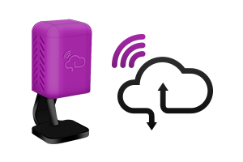
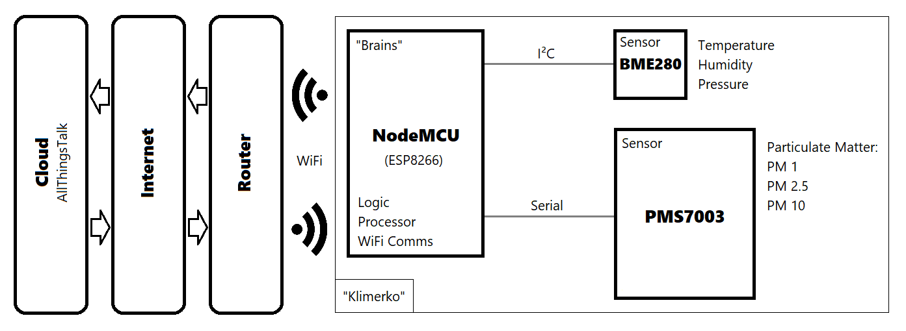
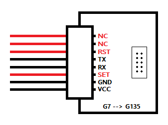
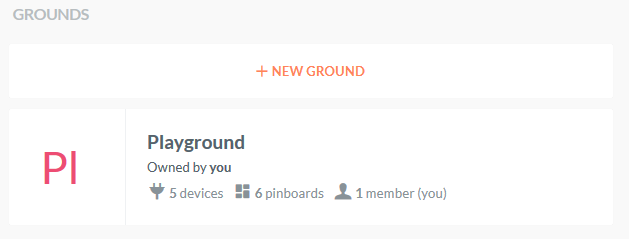
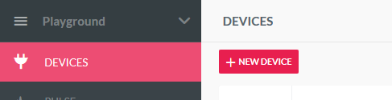
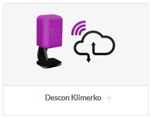
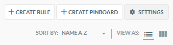
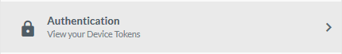
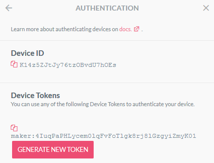
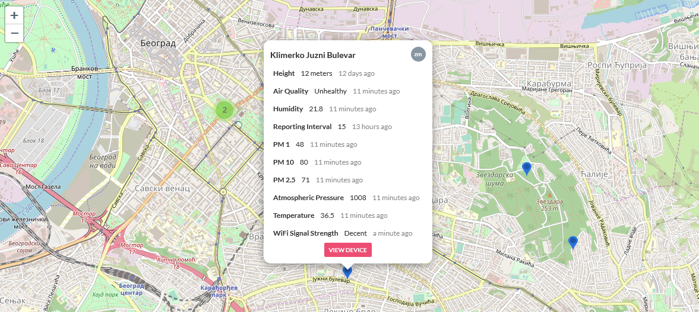

# “Klimerko” Air Quality Monitoring Station



"Klimerko" is the continuation of the [Winning Project from Descon 4.0 2018](https://descon.me/2018/winning-product/).  

See live data from all "Klimerko" devices in your area by going to [vazduhgradjanima.rs](https://vazduhgradjanima.rs)

This is a DIY air quality measuring device that costs about $30 to build (even less without the 3D Case) and measures [Particulate Matter](https://www.epa.gov/pm-pollution/particulate-matter-pm-basics) in the air as well as Temperature, Humidity and Pressure.  
It publishes data to your [AllThingsTalk Maker Cloud](https://www.allthingstalk.com/maker) (free) where you're able to visualize data, see it historically and control the device.   
Read on to find out how to build your own!


## Firmware Version History

**To update your existing Klimerko's Firmware, go to [Updating Firmware](#updating-firmware)**

| Version | Date | Notes |
|--|--|--|
| v1.3.0 | 28.1.2020 | Sensor data averaging system; 5 minutes minimum reporting interval; Erratic AQ readings fix; Textual values fixed  |
| v1.2.0 | 8.1.2020 | Utilize new publicly released AllThingsTalk SDK; Firmware version reporting |
| v1.1.6 | 6.1.2020 | Temperature sensor (BME280) calibration |
| v1.1.5 | 12.12.2019 | Fixed issue with unique device ID generation that could prevent the device to connect to AllThingsTalk |
| v1.1.4 | 6.11.2019 | Improved PMS7003 reading stability; Fixed bug with payload sending that was introduced in v1.1.3 |
| v1.1.3 | 5.11.2019 | Added Serial Monitor notification when BME280 fails to read data; Improved reliability when reconnecting to WiFi/AllThingsTalk and when loading credentials from memory |
| v1.1.2 | 23.10.2019 | Fixed issue where quitting device credentials configuration dialog would still save changes for that session |
| v1.1.1 | 23.10.2019 | Fixed configuring credentials on Linux |
| v1.1.0 | 20.10.2019 | Ability to configure credentials using Serial Monitor (no need to re-flash the whole device anymore); Updated textual form "Air Quality" reporting to use PM 10 values |
| v1.0.0 | 3.10.2019 | The initial firmware written for Descon 5.0 (2019) workshop |

# Table of Contents
This guide is in chronological order, so try not to skip through parts if you're not sure about it :)

* [Parts](#parts)
  * [Hardware Required](#hardware-required)
  * [Tools Required](#tools-required)
* [Hardware Assembly](#hardware-assembly)
  * [3D Case Preparation](#3d-case-preparation)
  * [PMS7003 Sensor Preparation](#pms7003-sensor-preparation)
  * [BME280 Sensor Preparation](#bme280-sensor-preparation)
  * [NodeMCU Preparation](#nodemcu-preparation)
* [Cloud Platform (Credentials)](#cloud-platform-credentials)
* [Software](#software)
  * [Installing ESP8266 Support](#installing-esp8266-support)
  * [Uploading Firmware](#uploading-firmware)
  * [Configuring Device Credentials](#configuring-device-credentials)
* [Cloud Platform (Final)](#cloud-platform-final)
  * [Configure Device](#configure-device)
  * [Share Data](#share-data)
  * [Visualize Data](#visualize-data)
* [Updating Firmware](#updating-firmware)
* [Problems & Fixes](#problems--fixes)


# Parts
This diagram shows an overview of how Klimerko works


## Hardware Required

You'll need these components to follow this guide.
Some items are clickable and you can buy them right away.

- [NodeMCU](https://www.aliexpress.com/item/33053690164.html) Board *(if buying, choose the "NodeMcu v3 CP2102")*
- [Plantower PMS7003](https://www.aliexpress.com/item/32623909733.html) Air Quality Sensor *(if buying, get the one with Bridge Board and Connector Cable)*
    - Bridge board
    - Connector cable
- [Bosch BME280](https://www.aliexpress.com/item/32817286611.html) Temperature/Humidity/Pressure Sensor *(if buying, choose the "3.3V" one)*
- USB Power adapter (5V, minimum 250mA/0.25A)
- MicroUSB Cable
- **4x** Wires (each at least 13cm long)
- ***Optional:*** 3D printed case for the device ([STL Files](https://github.com/DesconBelgrade/Klimerko/tree/master/Klimerko_Printable_Case)), which comprises of:
    - Components base
    - Weather-resistant cover
    - Flat stand
    - Wall-mount holder
    - Non-3D-Printed: **5x** Screws (for plastic, 3x5mm) (**7**x screws if you’re going to wall-mount the device)


## Tools Required

You’re going to need the following tools at minimum to complete the project:

- Soldering Iron
- Solder
- Scissors or a Wire Stripper
- Screwdriver (required only if using 3D printed case)


# Hardware Assembly

Once you’ve got all the components and tools ready, it’s time to begin the assembly process.  
  
When soldering, make sure that there's no solder between any two pins (connection holes in the board) on any of the components **before** plugging the device into a power source.  
**Pay attention to VIN and GND** pins on the NodeMCU, because shorting (connecting) those two pins together **will fry** NodeMCU and possibly the power source it's connected to.

## 3D Case Preparation

> You can print your own Klimerko Case using a 3D Printer using the [3D Print Files](https://github.com/DesconBelgrade/Klimerko/tree/master/Klimerko_Printable_Case). If you don't have a 3D Printer, your local hacker/makerspace most likely has one!

> In case you're not following this guide at a workshop: 
> You're still able to build this device if you don't have the 3D case. You'll just need to tinker and figure out how to place the device in a secure location away from rain/sun (but in an open space so it can detect pollution properly) 

Depending on your use case, you can use either the flat stand or the wall-mounted holder.
If you wish to wall-mount the device, use 2 screws to mount the holder to a wall. You’ll be able to easily attach and detach the device from the wall.

For now, disassemble the case and put away all the parts except for the components base, where you’ll be placing all the components.

## PMS7003 Sensor Preparation

- First, make sure **not** to remove the blue plastic cover from the PMS7003 sensor as it helps it fit into the 3D case better.
- Place the PMS7003 sensor into the components base of the 3D case with the connection port of PMS7003 facing outwards in upper right side.  
- Plug in the connector cable into the bridge board.  
- Because we don’t need excess cabling, removal of the unnecessary wires from the connector cable is suggested. In order to know which wires to pull, make sure the connector cable is plugged into the bridge board so that you can see the markings on the board that correspond to the wires. To remove the wires, pull them with medium force until they’re detached from the connector. 
These are the wires to pull (marked red):
    - **NC** (first one)
    - **NC** (second one)
    - **RST**
    - **SET**
    The only wires left attached should be **TX**, **RX**, **GND** and **VCC**.


    
- Measure ~13cm of all 4 remaining wires from the connector cable and cut the rest, so you’re left with the connector at one end and cut wires on the other.
- Using scissors or a wire stripper, remove the insulation ~2mm from the end of each wire, so you’re left with clear copper at the ends.
- Plug the bridge board (with the connector cable in) into the PMS7003 Sensor.
- Route the wires through the circular hole in the components base of the 3D case so it reaches the other side of the base.


## BME280 Sensor Preparation
- Take the 4 wires you have prepared (not to be confused with the PMS7003 wires) and strip (remove insulation) ~2mm from each end of each wire so that you have 4 wires with all ends stripped.
- Solder those 4 wires to pins **SDA**, **SCL**, **GND**, **VCC/VIN** on the BME280.  
  **If you have a 6-pin version of BME280, the CSB and SDO pins simply aren't used.**
- Make sure the PMS7003 Sensor is seated properly (because BME280 goes above it), and only then proceed to the next step.
- Mount the BME280 sensor in place by screwing it to the hole in the upper right side of the 3D case (above the PMS7003).
- Route the wires through the circular hole in the components base of the 3D case so it reaches the other side of the base.

You have now completed the setup of the sensor side of the components base.
Next up, the NodeMCU side.


## NodeMCU Preparation

You should now have 8 wires coming through the circular hole leading to the NodeMCU side of the 3D case.


- Solder the wires to the NodeMCU board:


> Please double check to make sure you’re soldering the correct wires (coming from the sensors) to the NodeMCU board.

| Sensor  | Sensor Wire | NodeMCU Pin             |
| ------- | ----------- | ----------------------- |
| PMS7003 | VCC         | VIN                     |
| PMS7003 | GND         | GND (Any GND pin works) |
| PMS7003 | RX          | D6                      |
| PMS7003 | TX          | D5                      |
| BME280  | VCC/VIN     | 3v3 (Any 3v3 pin works) |
| BME280  | GND         | GND (Any GND pin works) |
| BME280  | SCL         | D1                      |
| BME280  | SDA         | D2                      |

> You have now finished all steps that require soldering.

- Now use 4 screws to place the NodeMCU in its spot in the components base of the 3D case.
- Double check all the connections and if everything is as it should be.
- Put the weather-resistant cover of the 3D case over the components base (it's better to do this once everything is done and device is connected, though)

Congratulations, you’ve assembled the device! Now onto the software side.


# Cloud Platform (Credentials)
- Head over to https://maker.allthingstalk.com/signup and create an account
- Sign in
- Click “Playground”
    


- In *Devices*, click *+ New Device*
    


- Choose “Descon Klimerko”
    


- Click “Settings” in the upper right corner
    


- Click “Authentication”
    


- Write down your **Device ID** and **Device Token**
    



# Software
For all of the steps below, you'll need Arduino IDE (Integrated Development Environment).  
This is a tool that's used to send the "firmware" or "program" to your device.  

> If you already have Arduino IDE, **make sure it's at least version 1.8.10**

- Download and install [Arduino IDE](https://www.arduino.cc/en/Main/software) 
(choose “*Windows installer, for Windows XP and up*” if you’re on Windows, otherwise it'll download the Windows Store version, which might give you issues).

- If you're running **Apple's MacOS**, also [download and install the CP2102 Driver](https://www.silabs.com/documents/public/software/Mac_OSX_VCP_Driver.zip) in order to enable your Mac to recognize Klimerko for further steps.

## Installing ESP8266 Support
ESP8266 is the "brains" or "processor" of the NodeMCU, but Arduino IDE doesn't support it out-of-the-box. That's an easy one:
- Open Arduino IDE
- Go to *File* > *Preferences*
- In the *Additional Boards Manager URLs*, enter `http://arduino.esp8266.com/stable/package_esp8266com_index.json` and click *OK*
- Go to *Tools* > *Board* > *Boards Manager*
- Search for and install “*esp8266*” by *ESP8266 Community*
- Once done, close Arduino IDE

## Uploading Firmware
Your NodeMCU's "brain" is empty at the moment. Let's teach it what it needs to do by uploading the program to it:

- Plug in the USB cable into your Klimerko device and your computer
- Download https://github.com/DesconBelgrade/Klimerko/archive/master.zip
- Unzip the file, open it and go to “Klimerko_Firmware” folder
- Open “Klimerko_Firmware.ino” with Arudino IDE
- Now go to *Tools* > *Board* and choose “*NodeMCU 1.0 (ESP-12E Module)*”
- Go to *Tools* > *Upload Speed* and choose *115200*
- Go to *Tools* > *Port* and you should see **COM** and a number next to it. Choose it.
  - If you're running **MacOS**, choose */dev/cu.SLAB_USBtoUART*
- Go to “Sketch” > “Upload” and wait for the firmware to be uploaded to your Klimerko device

## Configuring Device Credentials
NodeMCU is now smart. It knows exactly what it needs to do, but it can't connect to the internet! Here's how you can tell it where to connect:

- Once you've uploaded the firmware, go to “Tools” > “Serial Monitor” and in the bottom right corner choose "115200 baud"
- Press the “RST” button on the NodeMCU
- When you see “*Write 'config' to configure your credentials (expires in 10 seconds)*” in Serial monitor, enter “config” in the upper part of and press ENTER
- Now enter “all” in the Serial Monitor input and press ENTER
> NodeMCU's WiFi works on 2.4GHz, so make sure the network you're connecting to **is not** 5GHz WiFi
- Enter your WiFi Network Name, WiFi Password and the Device ID and Device Token for communication with AllThingsTalk (noted earlier)
- Your device will now restart. Wait for it to boot.
> Use the Serial Monitor for diagnostic output from Klimerko. If you don’t see any data, restart Klimerko (either press the RST button on NodeMCU or unplug and plug it back in) because it’s currently not reading/publishing data, so there’s nothing to be shown.
- Once you see “Your device is up and running!” in Serial Monitor, you’re good to go!
- Feel free to unplug the device from your computer and plug it into a wall USB Power adapter with your 5m USB cable. 

> Note: There’s a blue LED light on the device that automatically starts “breathing/fading” when a connection to either WiFi or AllThingsTalk is being established or is dropped. If the LED isn’t “breathing/fading” (if it’s off), the device should be connected successfully and uploading data.


# Cloud Platform (Final)

All of the data from your Klimerko is available on your AllThingsTalk Maker.  
Other than raw actual and historical air quality values, you’re able to see your air quality in a textual form at a glance, see the WiFi Signal Strength of your Klimerko and control how often your Klimerko publishes data.  
You’ll also get notifications if your Klimerko goes offline for any reason.

## Configure Device

Open [AllThingsTalk Maker](https://maker.allthingstalk.com), go to “Devices” and select your new “Descon Klimerko” device.  
You’ll see all assets of your device (stuff that it can report and things you can control).

> Make sure to keep the data (that you’re about to set below) updated if you move your device

- Click on the “Location” asset and select the location of your Klimerko on the map
- Click on the “Height” asset and set the height of your device (in **meters**) by adding a value right next to `"value":`  and clicking the ✔️ button when done (below is an example of 10 meters height):
```
    {
        "at": "2019-10-18T11:28:04.554Z",
        "value": 10
    }
```
This needs to be done since air pollution readings are different on different heights.


## Share Data

Go to your “Decon Klimerko” device, click “Settings” in the upper right corner, go to “Share data” and share your data with “**Vazduh gradjanima**”.  
Your device will now be visible on the map at [vazduhgradjanima.rs](https://vazduhgradjanima.rs) and can help the community be aware of the air quality!  

 


## Visualize Data

Now go to “Pinboards” on the left side of AllThingsTalk Maker.  
You should see a new pinboard named “Klimerko”. Select it if it isn’t already selected.  
All data from your Klimerko is visualized here:

- Air Quality (in textual form)  
    Value shown will also have a corresponding background color.  
    This value is derived from PM10 values (as per [regulations of Republic of Serbia](http://www.amskv.sepa.gov.rs/kriterijumi.php)):
    
| Textual Value | PM 10 Value |
| ------------- | ----------- |
| Excellent | 0 - 20 |
| Good | 21 - 40 |
| Acceptable | 41 - 50 |
| Polluted | 51 - 100 |
| Very Polluted | 100 > |

- Actual PM1, PM2.5, PM10, Temperature, Humidity and Pressure data
- Historical PM1, PM2.5, PM10, Temperature, Humidity and Pressure data
- Location of your device on the map (that you’ve set)
- WiFi Signal Strength of your Klimerko device  
    Possible values (from good to bad): Excellent, Good, Decent, Bad, Horrible.  
    The values shown will also have a corresponding background color.
- Device height (that you’ve set)
- Device reporting interval (minutes)  
    You can use this slider to control how often your Klimerko reports its data to AllThingsTalk. The default and recommended value is 15 minutes.

**You’re done!**  
Enjoy your device and feel free to visit [vazduhgradjanima.rs](https://vazduhgradjanima.rs) and see your device along with all the other devices just like yours that are helping others be aware of the air pollution in your area!

# Updating Firmware
This step is for those who've already built their Klimerko and wish to update its firmware to the latest version.

- Plug in the USB cable into your Klimerko and your computer
- [Download the latest Klimerko Firmware](https://github.com/DesconBelgrade/Klimerko/archive/master.zip)
- Unzip the file, open it and go to “*Klimerko_Firmware*” folder
- Open “*Klimerko_Firmware.ino*” with Arudino IDE
- Make sure you're running at least Arduino IDE version 1.8.10
  - If on Windows, click *Help > About Arduino* to check version
  - If on MacOS, click *Arduino > About Arduino* to check version
  - In case you're on a version older than 1.8.10, simply download [Arduino IDE](https://www.arduino.cc/en/Main/software) again and install it.
    - If on Windows, choose “*Windows installer, for Windows XP and up*” when downloading
- Go to *Tools* > *Board* > *Boards Manager*
- Search for “*esp8266*” by *ESP8266 Community*
  -  Even if you already have this installed, you need to have the latest version, so click the **Update** button next to the result if you see it. If not, you probably already have the latest version.
  - If for some reason you don't see the search result, make sure you've [installed ESP8266 support](#installing-esp8266-support)
- Now go to *Tools* > *Board* and choose “*NodeMCU 1.0 (ESP-12E Module)*”
- Go to *Tools* > *Upload Speed* and choose *115200*
- Go to *Tools* > *Port* and you should see **COM** and a number next to it. Choose it.
  - If you're running **MacOS**, choose **/dev/cu.SLAB_USBtoUART** (if you don't see it, install [the driver first](https://www.silabs.com/documents/public/software/Mac_OSX_VCP_Driver.zip))
- Go to *Tools* > *Erase Flash* > *Only Sketch*
- Go to “Sketch” > “Upload” and wait for the firmware to be uploaded to your Klimerko device
- ***Optional:*** Open Serial Monitor (*Tools > Serial Monitor*), set it to 115200 baud rate and check Klimerko diagnostic output to see if everything is working.

Awesome! Your Klimerko is now updated to the latest version!

# Problems & Fixes
- If you're having compiling issues (orange errors in the bottom of Arduino IDE), make sure that:
	- Your Arduino IDE is at least version **1.8.10**
	- You've downloaded the latest firmware from https://github.com/DesconBelgrade/Klimerko/archive/master.zip
	- You've selected the correct board and port as shown [here](#upload-firmware)
    - You're running the latest version of ESP8266 Core
      - In Arduino IDE, go to *Tools* > *Board* > *Boards Manager*
      - Search for “*esp8266*” by *ESP8266 Community*
      - Click the **Update** button shown next to the result (if you don't see it, you're probably running the latest version)
- If your device is showing unintelligible text in Serial Monitor:
	- Make sure your Serial Monitor is set to baud rate of 115200 (set this in the bottom right corner of Serial Monitor)
- If your device won't connect to WiFi or AllThingsTalk
	- Make sure your credentials are correct. Check if you copied [AllThingsTalk credentials](#cloud-platform-credentials) and your WiFi credentials correctly. [Reconfigure credentials to make sure.](#configuring-device-credentials)
	- Make sure Klimerko is not too far away from your Router
	- Make sure your Router has internet access
- If your device is connected, but the sensor data you're seeing on AllThingsTalk is "0":
	- [Check your wiring](#hardware-assembly) to make sure everything is connected properly.
	- Make sure that there's no solder between any two pins on the board (either the NodeMCU or the BME280 sensor). If this is the case, it is causing a short-circuit and could break the device.
	- Make sure that you haven't removed too much insulation from the wires. In this case, one wire could be touching another wire with the exposed part, causing a short-circuit. If that's the case, de-solder the wire, cut it shorter (only 2mm or less should be exposed before soldering) and solder it back.
- If it seems your device won't turn on:
	- The NodeMCU has a blue LED right above the small shiny metallic box. That LED blinks for a brief moment right when you plug the device into power. If yours doesn't blink when you plug it in, check the USB cable (and try another one if you have it). If that makes no difference, check the power supply (the adapter).
	- Make sure that there's no solder between any two pins on the board (either the NodeMCU or the BME280 sensor). If this is the case, it is causing a short-circuit and could break the device. 
	- Make sure that you haven't removed too much insulation from the wires. In this case, one wire could be touching another wire with the exposed part, causing a short-circuit. If that's the case, de-solder the wire, cut it shorter (so only 2mm or less is exposed) and solder it back.
