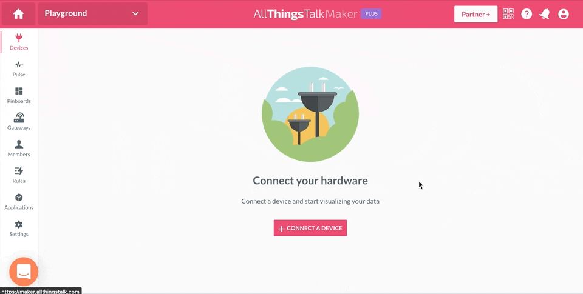

# “Klimerko” Air Quality Monitoring Station

Join the development discussion on our Matrix room: [#klimerko:matrix.org](https://matrix.to/#/!cIYLKLHZVnvAgFaZrg:matrix.org?via=matrix.org)


"Klimerko" is the continuation of the [Winning Project from Descon 4.0 2018](https://descon.me/2018/winning-product/).  

See live data from all Klimerko devices: [Klimerko.org](https://klimerko.org)

This is an affordable DIY air quality station that measures [Particulate Matter](https://www.epa.gov/pm-pollution/particulate-matter-pm-basics) concentration as well as Temperature, Humidity and Pressure.  
It publishes data to your [AllThingsTalk Maker Cloud](https://www.allthingstalk.com/maker) (free) where you're able to visualize data, see it historically and control the device.   
Continue reading to find out how to build your own, or watch the video below that covers the process.
  
> ***NOTICE:*** The video was created before the release of Klimerko Firmware v2.0.0, which introduced WiFi Configuration Mode, so the process of connecting the device to WiFi and AllThingsTalk shown in the video is outdated.

[](https://www.youtube.com/watch?v=D9VHvuHtT14)

**Having issues? Go to the [Troubleshooting](#troubleshooting) section.**  
**To update your Klimerko, go to [Updating Firmware](#updating-firmware)**.

# Table of Contents
This guide is in chronological order, so try not to skip through parts if you're not sure about it.

* [Hardware Build](#hardware-build)
  * [Hardware Required](#hardware-required)
  * [Tools Required](#tools-required)
  * [3D Case Preparation](#3d-case-preparation)
  * [PMS7003 Sensor Preparation](#pms7003-sensor-preparation)
  * [BME280 Sensor Preparation](#bme280-sensor-preparation)
  * [NodeMCU Preparation](#nodemcu-preparation)
* [Cloud Platform (1/2)](#cloud-platform-12)
* [Software](#software)
  * [Installing ESP8266 Support](#installing-esp8266-support)
  * [Uploading Firmware](#uploading-firmware)
  * [Configuring Klimerko Credentials and Temperature Offset](#configuring-klimerko-credentials-and-temperature-offset)
* [Cloud Platform (2/2)](#cloud-platform-22)
  * [Configure Device](#configure-device)
  * [Share Data](#share-data)
  * [Visualize Data](#visualize-data)
* [Updating Firmware](#updating-firmware)
  * [Updating Wirelessly (OTA)](#updating-wirelessly-ota)
  * [Updating using Arduino IDE](#updating-using-arduino-ide)
* [Toubleshooting](#troubleshooting)
  * [Use Serial Monitor](#use-serial-monitor)
  * [Compilation issues](#compilation-issues)
  * [Klimerko can't see WiFi network](#klimerko-cant-see-wifi-network)
  * [Can't connect to Klimerko to configure it](#cant-connect-to-klimerko-to-configure-it)
  * [Klimerko isn't connecting to WiFi or AllThingsTalk](#klimerko-isnt-connecting-to-wifi-or-allthingstalk)
  * [Assets not being updated](#assets-not-being-updated)
  * [Klimerko won't turn on](#klimerko-wont-turn-on)
  * [Factory Reset your Klimerko](#factory-reset-your-klimerko)


# Hardware Build
This diagram shows an overview of how Klimerko works


## Hardware Required

You'll need these components to follow this guide: 

> Previously, some of the components below were clickable so you could buy them right away, but shipping to Balkans on some websites became 10x more expensive than the components themselves, therefore the list now only contains the names, description and a photo of the items you need to buy.  
You can search for these components on [eBay](https://ebay.com), [Banggood](https://banggood.com), [AliExpress](https://aliexpress.com) or your local electronics store/website.

- **NodeMCU (Amica, with CP2102 chip)**  
  Try to avoid the cheapest ones as they're using a different pinout and a weaker CHG340 chip.  
  It should look exactly like this:  
  

- **Plantower PMS7003 Air Quality Sensor**  
  Get the one with a connector and a bridge board.  
  Should look exactly like this:  
  

- **Bosch BME280 Temperature/Humidity/Pressure Sensor**  
  Make sure to get the BM**E**280 and ***not*** the cheaper BM**P**280.  
  There are variants with 6 pins, and if you find them to be cheaper than the ones with 4 pins (as shown below), you can buy that as well - you just won't use additional 2 pins.  
  It should look exactly like this:  
  

- USB Power adapter (5V, minimum 250mA/0.25A)
- MicroUSB Cable
- **4x** Wires (each at least 13cm long)
- ***Optional:*** 3D printed case for the device ([STL Files](https://github.com/DesconBelgrade/Klimerko/tree/master/Klimerko_Printable_Case)), which comprises of:
    - Components base
    - Weather-resistant cover
    - Flat stand
    - Wall-mount holder
    - Non-3D-Printed: **5x** Screws (for plastic, 3x5mm) (**7**x screws if you’re going to wall-mount the device)


## Tools Required

You’re going to need the following tools at minimum to complete the project:

- Soldering Iron
- Solder
- Scissors or a Wire Stripper
- Screwdriver (required only if using 3D printed case)


## Hardware Assembly

Once you’ve got all the components and tools ready, it’s time to begin the assembly process.  
  
When soldering, make sure that there's no solder between any two pins (connection holes in the board) on any of the components **before** plugging the device into a power source.  
**Pay attention to VIN and GND** pins on the NodeMCU, because shorting (connecting) those two pins together **will fry** NodeMCU and possibly the power source it's connected to.

## 3D Case Preparation

> You can print your own Klimerko Case using a 3D Printer using the [3D Print Files](https://github.com/DesconBelgrade/Klimerko/tree/master/Klimerko_Printable_Case). If you don't have a 3D Printer, your local hacker/makerspace most likely has one!

> In case you're not following this guide at a workshop: 
> You're still able to build this device if you don't have the 3D case. You'll just need to tinker and figure out how to place the device in a secure location away from rain/sun (but in an open space so it can detect pollution properly) 

Depending on your use case, you can use either the flat stand or the wall-mounted holder.
If you wish to wall-mount the device, use 2 screws to mount the holder to a wall. You’ll be able to easily attach and detach the device from the wall.

For now, disassemble the case and put away all the parts except for the components base, where you’ll be placing all the components.

## PMS7003 Sensor Preparation

- First, make sure **not** to remove the blue plastic cover from the PMS7003 sensor as it helps it fit into the 3D case better.
- Place the PMS7003 sensor into the components base of the 3D case with the connection port of PMS7003 facing outwards in upper right side.  
- Plug in the connector cable into the bridge board.  
- Because we don’t need excess cabling, removal of the unnecessary wires from the connector cable is suggested. In order to know which wires to pull, make sure the connector cable is plugged into the bridge board so that you can see the markings on the board that correspond to the wires. To remove the wires, pull them with medium force until they’re detached from the connector. 
These are the wires to pull (marked red):
    - **NC** (first one)
    - **NC** (second one)
    - **RST**
    - **SET**
    The only wires left attached should be **TX**, **RX**, **GND** and **VCC**.


    
- Measure ~13cm of all 4 remaining wires from the connector cable and cut the rest, so you’re left with the connector at one end and cut wires on the other.
- Using scissors or a wire stripper, remove the insulation ~2mm from the end of each wire, so you’re left with clear copper at the ends.
- Plug the bridge board (with the connector cable in) into the PMS7003 Sensor.
- Route the wires through the circular hole in the components base of the 3D case so it reaches the other side of the base.


## BME280 Sensor Preparation
- Take the 4 wires you have prepared (not to be confused with the PMS7003 wires) and strip (remove insulation) ~2mm from each end of each wire so that you have 4 wires with all ends stripped.
- Solder those 4 wires to pins **SDA**, **SCL**, **GND**, **VCC/VIN** on the BME280.  
  **If you have a 6-pin version of BME280, the CSB and SDO pins simply aren't used.**
- Make sure the PMS7003 Sensor is seated properly (because BME280 goes above it), and only then proceed to the next step.
- Mount the BME280 sensor in place by screwing it to the hole in the upper right side of the 3D case (above the PMS7003).
- Route the wires through the circular hole in the components base of the 3D case so it reaches the other side of the base.

You have now completed the setup of the sensor side of the components base.
Next up, the NodeMCU side.


## NodeMCU Preparation

You should now have 8 wires coming through the circular hole leading to the NodeMCU side of the 3D case.


- Solder the wires to the NodeMCU board:


> Please double check to make sure you’re soldering the correct wires (coming from the sensors) to the NodeMCU board.

| Sensor  | Sensor Wire | NodeMCU Pin             |
| ------- | ----------- | ----------------------- |
| PMS7003 | VCC         | VIN                     |
| PMS7003 | GND         | GND (Any GND pin works) |
| PMS7003 | RX          | D6                      |
| PMS7003 | TX          | D5                      |
| BME280  | VCC/VIN     | 3v3 (Any 3v3 pin works) |
| BME280  | GND         | GND (Any GND pin works) |
| BME280  | SCL         | D1                      |
| BME280  | SDA         | D2                      |

> You have now finished all steps that require soldering.

- Now use 4 screws to place the NodeMCU in its spot in the components base of the 3D case.
- Double check all the connections and if everything is as it should be.
- Put the weather-resistant cover of the 3D case over the components base (it's better to do this once everything is done and device is connected, though)

Congratulations, you’ve assembled the device! Now onto the software side.


# Cloud Platform (1/2)
- Head over to [AllThingsTalk Maker](https://maker.allthingstalk.com) and create a free account
- Sign in
- Click “Playground”
- In "Devices", click "+ New Device"
- Choose “Descon Klimerko”
- Click “Settings” in the upper right corner
- Click “Authentication”
- Write down your **Device ID** and **Device Token**




# Software
For all of the steps below, you'll need Arduino IDE (Integrated Development Environment).  
This is a tool that's used to send the "firmware" or "program" to your device.  

> If you already have Arduino IDE, make sure it's **at least** version 1.8.15

- Download and install [Arduino IDE](https://www.arduino.cc/en/software) 
(choose “*Windows installer, for Windows XP and up*” if you’re on Windows, otherwise it'll download the Windows Store version, which might give you issues).

- If you're on **Microsoft Windows**, [download and install the CP2102 Driver for Windows](https://www.silabs.com/documents/public/software/CP210x_Universal_Windows_Driver.zip).

- If you're on **Apple's MacOS**, [download and install the CP2102 Driver for MacOS](https://www.silabs.com/documents/public/software/Mac_OSX_VCP_Driver.zip).

## Installing ESP8266 Support
ESP8266 is the "brains" or "processor" of the NodeMCU, but Arduino IDE doesn't support it out-of-the-box. That's an easy one:
- Open Arduino IDE
- Go to *File* > *Preferences*
- In the *Additional Boards Manager URLs*, enter `http://arduino.esp8266.com/stable/package_esp8266com_index.json` and click *OK*
- Go to *Tools* > *Board* > *Boards Manager*
- Search for “*esp8266*” by *ESP8266 Community*
- Click *Install*
- Once done, close the window.

## Uploading Firmware
Your NodeMCU's "brain" is empty at the moment. Let's teach it what it needs to do by uploading the program to it:

- Plug in the USB cable into your Klimerko device and your computer
- Download https://github.com/DesconBelgrade/Klimerko/archive/master.zip
- Unzip the file, open it and go to “Klimerko_Firmware” folder
- Open “Klimerko_Firmware.ino” with Arudino IDE
- Now go to *Tools* > *Board* and choose “*NodeMCU 1.0 (ESP-12E Module)*”
- Go to *Tools* > *Upload Speed* and choose *115200*
- Go to *Tools* > *Port* and you should see **COM** and a number next to it. Choose it.
  - If you have multiple COM ports available and the one you've chosen doesn't work, try the other ones as well.
  - If you're running **MacOS**, choose */dev/cu.SLAB_USBtoUART*
- Go to “Sketch” > “Upload” and wait for the firmware to be uploaded to your Klimerko device

## Configuring Klimerko Credentials and Temperature Offset
> Since Klimerko Firmware version 2.0.0, the process of entering WiFi & Platform credentials has been immensely simplified by introducing WiFi Configuration Mode, a feature where Klimerko itself becomes a WiFi Access Point to which you can connect to using your computer or smartphone and then configure the credentials using a simple web interface that opens up automatically once you're connected to your Klimerko.  

You need tell your Klimerko which credentials to use to connect to the platform and to which WiFi to connect to: 

- Make sure your Klimerko is connected to power.
- Lift your Klimerko's cover to expose the NodeMCU board.
- Press and hold the **FLASH** button for 2 seconds and then let go.
- The blue LED on the NodeMCU should turn on and stay on. This indicates the WiFi Configuration Mode is currently active and you can connect to your Klimerko.
- Using your computer or a smartphone, search for and connect to WiFi Network ***"KLIMERKO-XXX"*** (the X's are numbers) using password **"ConfigMode"**.
- Your device should automatically open Klimerko's WiFi Configuration Portal. If it doesn't, navigate to **[192.168.4.1](http://192.168.4.1)** in your browser. 
- Click the first **"Configure WiFi"** button.
- A list of available WiFi Networks will be shown, along with a field to enter your AllThingsTalk Device ID and Device Token.
  > NodeMCU only supports 2.4GHz, so make sure the network you're trying to connect your Klimerko to **is not** a 5GHz network.
- Select your WiFi network from the list (or manually enter WiFi network name if you're not in range of the network you plan to use your Klimerko on), enter your WiFi Password and copy/paste the AllThingsTalk Device ID and Device Token that you noted in previous step ([Cloud Platform Credentials](#cloud-platform-12))
  > If you are updating your credentials, it is possible to only update some of them by leaving other fields empty. The empty fields will not overwrite the values stored in memory when saving.
- You can set a custom **Temperature Offset** if you wish. This will affect temperature readings from the device and humidity readings will be compensated for the temperature offset as well.
  > Configurable Temperature Offset has been introduced in Firmware Version 2.1.0. The default offset is `-4°C`. Decimals, negative and positive values are supported (e.g. `-1.2`, `3.58`, `+3.58`, `-7.43`). Positive values can be set with or without the `+` prefix. The maximum positive offset is 25°C, and maximum negative is -25°C. If you wish to use the default value, simply leave the **Temperature Offset** field as it is. As opposed to WiFi Credentials and AllThingsTalk Credentials, the Temperature Offset field always displays the currently used value.
- Click ***"Save"***. 
- Klimerko has now automatically shut down the WiFi Configuration Mode (the blue LED stops shining constantly) and your computer/smartphone will disconnect from "KLIMERKO-XXX" network. The WiFi Configuration Portal will automatically close on your computer/smartphone only if it was automatically opened. Otherwise, you'll need to close the browser tab.
- Your Klimerko will now attempt to connect to WiFi and AllThingsTalk, indicated by slow blinking of the LED light.
- Observe the LED on the NodeMCU. If it blinks quickly a few times and then turns off completely, your Klimerko is connected to both WiFi and AllThingsTalk. Otherwise, repeat the process (the credentials could be incorrect) or check the [Troubleshooting section](#troubleshooting).

> The blue LED light on NodeMCU blinks slowly (in 1 second intervals) when Klimerko is trying to connect to WiFi or AllThingsTalk (or if the connection can't be established).  
If it blinks rapidly a few times and then turns off, the connection to WiFi and AllThingsTalk has been made succesfully.  
If it's turned on constantly, it means the WiFi Configuration Mode is currently active and you can connect to your Klimerko using your smartphone.  
If you wish to turn off WiFi Configuration Mode without configuring your Klimerko, press the ***"FLASH"*** button on your NodeMCU quickly, once. The constant blue LED should turn off.


# Cloud Platform (2/2)

All of the data from your Klimerko is available on your AllThingsTalk Maker.  
Other than raw actual and historical air quality values, you’re able to see your air quality in a textual form at a glance, see the WiFi Signal Strength of your Klimerko and control how often your Klimerko publishes data.  
You’ll also get notifications if your Klimerko goes offline for any reason.

## Configure Device

Open [AllThingsTalk Maker](https://maker.allthingstalk.com), go to “Devices” and select your new “Descon Klimerko” device.  
You’ll see all assets of your device (stuff that it can report and things you can control).

> Make sure to keep the data (that you’re about to set below) updated if you move your device

- Click on the “Location” asset and select the location of your Klimerko on the map
- Click on the “Height” asset and set the height of your device (in **meters**) by adding a value right next to `"value":`  and clicking the ✔️ button when done (below is an example of 10 meters height):
```
    {
        "at": "2019-10-18T11:28:04.554Z",
        "value": 10
    }
```
This needs to be done since air pollution readings are different on different heights.


## Share Data

Go to your “Decon Klimerko” device, click “Settings” in the upper right corner, go to “Share data” and share your data with “**Vazduh gradjanima**”.  
Your device will now be visible on the map at [Klimerko.org](https://klimerko.org) and can help the community be aware of the air quality!  

 


## Visualize Data

Now go to “Pinboards” on the left side of AllThingsTalk Maker.  
You should see a new pinboard named “Klimerko”. Select it if it isn’t already selected.  
All data from your Klimerko is visualized here:

- Air Quality (in textual form)  
    Value shown will also have a corresponding background color.  
    This value is derived from PM10 values (as per [regulations of Republic of Serbia](http://www.amskv.sepa.gov.rs/kriterijumi.php)):
    
| Textual Value | PM 10 Value |
| ------------- | ----------- |
| Excellent | 0 - 20 |
| Good | 21 - 40 |
| Acceptable | 41 - 50 |
| Polluted | 51 - 100 |
| Very Polluted | 100 > |

- Actual PM1, PM2.5, PM10, Temperature, Humidity and Pressure data
- Historical PM1, PM2.5, PM10, Temperature, Humidity and Pressure data
- Location of your device on the map (that you’ve set)
- WiFi Signal Strength of your Klimerko device  
    Possible values (from good to bad): Excellent, Good, Decent, Bad, Horrible.  
    The values shown will also have a corresponding background color.
- Device height (that you’ve set)
- Device reporting interval (minutes)  
    You can use this slider to control how often your Klimerko reports its data to AllThingsTalk. The default and recommended value is 15 minutes.

**You’re done!**  
Enjoy your device and feel free to visit [Klimerko.org](https://klimerko.org) and see your device along with all the other devices just like yours that are helping others be aware of the air pollution in your area!

# Updating Firmware
This step is for those who've already built their Klimerko and wish to update its firmware to the latest version.  

To check what Firmware version your Klimerko is on, you can:
  - Open your Klimerko device on your [AllThingsTalk Maker](https://maker.allthingstalk.com):  
  The Firmware Version will be stored in the "Firmware Version" asset.  
  - Use Serial Monitor in Arduino IDE:  
  Klimerko will output the Firmware Version in the first few lines once it boots.
  - *Version 2.0.0 and above only:* Activate WiFi Configuration Mode  and click **Configure WiFi**:  
  The Firmware Version will be written in the bottom part of the page.  
  To exit WiFi Configuration Mode, go back and click "EXIT" or click the **FLASH** button once on NodeMCU.  

> If you are updating from a version before 2.0.0 to version 2.0.0 or above, you'll need to [re-enter the credentials](#configuring-klimerko-credentials) once you've updated your device.  
This only applies to aforementioned cases due to changes in how data is stored in firmwares 2.0.0 and above.

## Updating Wirelessly (OTA)
> Use this method if your Klimerko is currently on firmware version 2.0.0 or above.
- Download ***[Klimerko_Firmware.bin](https://github.com/DesconBelgrade/Klimerko/raw/master/Klimerko_Firmware/Klimerko_Firmware.bin)***
- Connect your Klimerko to power.
- Take off the 3D printed cover (if present).
- Enter WiFi Configuration Mode by holding the ***"FLASH"*** button on the NodeMCU board for 2 seconds and then let go (Klimerko's LED should turn on and stay solid blue, indicating WiFi Configuration Mode is on).
- Using your computer/smartphone, connect to WiFi Network  **"KLIMERKO-XXX"** using password **"ConfigMode"**
- Klimerko's WiFi Configuration Portal may automatically open outside of your browser once you connect to it - ignore it in this case.
- Open the browser on your computer/smartphone and navigate to **[192.168.4.1](http://192.168.4.1)** to manually open WiFi Configuration Portal.
- Click the  **UPDATE** button.
- Click **Browse** and select the *"Klimerko_Firmware.bin"* file you downloaded earlier.
- Click the red **UPDATE** button and wait for it to confirm that the update is finished.
- Your Klimerko will reboot.

## Updating using Arduino IDE
> Use this method if your Klimerko is on a firmware older than v2.0.0 or you're having issues with Over-The-Air updating.
- Plug in the USB cable into your Klimerko and your computer
- [Download the latest Klimerko Firmware](https://github.com/DesconBelgrade/Klimerko/archive/master.zip)
- Unzip the file, open it and go to “*Klimerko_Firmware*” folder
- Open “*Klimerko_Firmware.ino*” with Arudino IDE
- Make sure you're running at least Arduino IDE version 1.8.15
  - If on Windows, click *Help > About Arduino* to check version
  - If on MacOS, click *Arduino > About Arduino* to check version
  - In case you're on a version older than 1.8.15, simply download [Arduino IDE](https://www.arduino.cc/en/Main/software) again and install it.
    - If on Windows, choose “*Windows installer, for Windows 7 and up*” when downloading
- Go to *Tools* > *Board* > *Boards Manager*
- Search for “*esp8266*” by *ESP8266 Community* and click "Install" or "Update" if you already have it installed.
  - If for some reason you don't see the search result, make sure you've [installed ESP8266 support](#installing-esp8266-support)
- Now go to *Tools* > *Board* and choose “*NodeMCU 1.0 (ESP-12E Module)*”
- Go to *Tools* > *Upload Speed* and choose *115200*
- Go to *Tools* > *Port* and you should see **COM** and a number next to it. Choose it.
  - If you have multiple COM ports available and the one you've chosen doesn't work, try the other ones as well.
  - If you're running **MacOS**, choose **/dev/cu.SLAB_USBtoUART** or **/dev/cu.usbserial-0001** (if you don't see it, install [the driver first](https://www.silabs.com/documents/public/software/Mac_OSX_VCP_Driver.zip))
- Go to *Tools* > *Erase Flash* > *Only Sketch*
- Go to “Sketch” > “Upload” and wait for the firmware to be uploaded to your Klimerko device
- ***Optional:*** Open Serial Monitor (*Tools > Serial Monitor*), set it to 115200 baud rate and check Klimerko diagnostic output to see if everything is working.

Awesome! Your Klimerko is now updated to the latest version!

# Troubleshooting
## Update to newest firmware
Before anything else, make sure you've updated your Klimerko to the newest Firmware by following the [Updating Firmware](#updating-firmware) section.

## Use Serial Monitor
To see what's really going on under the hood, use the Serial Monitor tool provided in Arduino IDE:
  - Connect your Klimerko to your computer
  - Open Arduino IDE
  - Select *Tools > Port* and select the correct port
  - Go to *Tools > Serial Monitor* in Arduino IDE
  - You will now see diagnostic output from your Klimerko.  

If your device is showing unintelligible text in Serial Monitor:
  - Make sure your Serial Monitor is set to baud rate of 115200 (set this in the bottom right corner of Serial Monitor)  

## Compilation issues
If you're having compiling issues (orange errors in the bottom of Arduino IDE), make sure that:
  - Your Arduino IDE is at least version **1.8.15**
  - You've downloaded the latest firmware from https://github.com/DesconBelgrade/Klimerko/archive/master.zip
  - You've selected the correct board and port as shown [here](#upload-firmware)
  - You're running the latest version of ESP8266 Core
    - In Arduino IDE, go to *Tools* > *Board* > *Boards Manager*
    - Search for “*esp8266*” by *ESP8266 Community*
    - Click the **Update** button shown next to the result (if you don't see it, you're probably running the latest version).

## Klimerko can't see WiFi network
  - Make sure the network you're trying to connect your Klimerko to is a 2.4GHz network, and not a 5GHz one as NodeMCU only supports 2.4GHz.
  - Make sure you're in range.

## Can't connect to Klimerko to configure it
If you can't connect to your Klimerko when it's in WiFi Configuration Mode or you can't open WiFi Configuration Portal (192.168.4.1):
  - Disconnect and reconnect to "KLIMERKO-XXX" WiFi Access Point and try again
  - Forget the "KLIMERKO-XXX" WiFi network on your device and try connecting again (password is "ConfigMode")
  - Turn off WiFi on your device, wait a few seconds, and then turn it back on and try again

## Klimerko isn't connecting to WiFi or AllThingsTalk
If your device won't connect to WiFi or AllThingsTalk (blue LED on NodeMCU constantly blinking slowly):
  - If you updated your Klimerko's Firmware from a version below 2.0.0 to version 2.0.0 or above, you will need to [re-enter your WiFi and AllThingsTalk credentials](#configuring-klimerko-credentials) just this time, as noted in [Updating Firmware](#updating-firmware).
  - Make sure your credentials are correct. Check if you copied your [AllThingsTalk credentials](#cloud-platform-12) and your WiFi credentials correctly. [Reconfigure credentials to make sure.](#configuring-klimerko-credentials)  
    - If you only need to update WiFi Credentials, you can leave "AllThingsTalk Device ID" and "AllThingsTalk Device Token" fields empty when saving.
    - If you only need to update AllThingsTalk Credentials, you can leave the WiFi fields empty when saving.
    - If you only need to update "AllThingsTalk Device ID", you can leave WiFi and "AllThingsTalk Device Token" fields empty when saving.
    - If you only need to update "AllThingsTalk Device Token", you can leave WiFi and "AllThingsTalk Device ID" fields empty when saving.
  - Turn on WiFi Configuration Mode on your Klimerko by pressing and holding the **FLASH** button on the NodeMCU board.  
  Connect to your Klimerko using WiFi and once the WiFi Configuration Portal is open, you should see the WiFi connection status at the bottom of the page.
  - Make sure Klimerko is not too far away from your Router.
  - Make sure your Router has internet access.

## Assets not being updated
If your device is connected, but some assets are not being updated (or only "Interval", "WiFi Signal" and "Firmware Version" assets are being updated):
  - This means one or both of your sensors aren't connected.
  - If assets "PM1", "PM2.5", "PM10" and "Air Quality" aren't being updated, your PMS7003 sensor isn't connected properly.
  - If assets "Temperature", "Humidity" and "Pressure" aren't being updated, your BME280 sensor isn't connected properly.
  - [Check your wiring](#hardware-assembly) to make sure everything is connected properly.
  - Make sure that there's no solder between any two pins on the board (either the NodeMCU or the BME280 sensor). If this is the case, it is causing a short-circuit and could break the device.
  - Make sure that you haven't removed too much insulation from the wires. In this case, one wire could be touching another wire with the exposed part, causing a short-circuit. If that's the case, de-solder the wire, cut it shorter (only 2mm or less should be exposed before soldering) and solder it back.

## Klimerko won't turn on
  - The NodeMCU has a blue LED right above the small shiny metallic box. That LED blinks for a brief moment right when you plug the device into power. If yours doesn't blink when you plug it in, check the USB cable (and try another one if you have it). If that makes no difference, check the power supply (the adapter).
  - Make sure that there's no solder between any two pins on the board (either the NodeMCU or the BME280 sensor). If this is the case, it is causing a short-circuit and could break the device. 
  - Make sure that you haven't removed too much insulation from the wires. In this case, one wire could be touching another wire with the exposed part, causing a short-circuit. If that's the case, de-solder the wire, cut it shorter (so only 2mm or less is exposed) and solder it back.

## Factory Reset your Klimerko
  - Press and hold the ***FLASH*** button on the NodeMCU board for at least 15 seconds.
  - The blue LED should flash rapidly for 2 seconds and then stay on.
  - Your Klimerko has now deleted all credentials and temperature offset data from itself and will restart shortly.
  - Once the LED turns off, Klimerko has been restarted.
  - The LED will now blink slowly, indicating it's trying to connect to WiFi and AllThingsTalk (but it can't, since there's no credentials)
  - You can now follow [Configuring Klimerko Credentials and Temperature Offset](#configuring-klimerko-credentials-and-temperature-offset) again.
